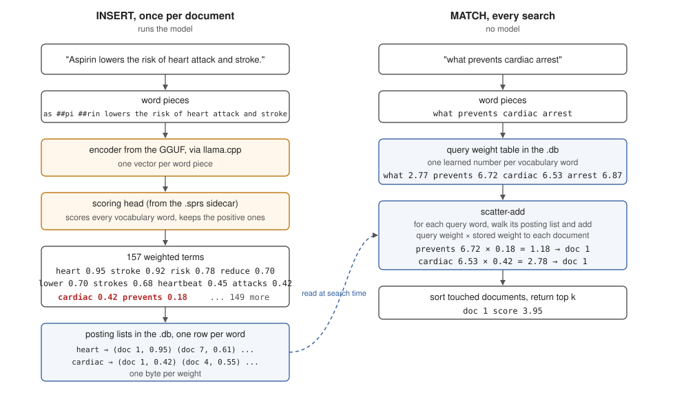

# sqlite-sparse

Run a sparse retrieval model on SQLite. No model required at query time.

*For small, read-heavy systems that need semantic search. Documents are encoded once at
insert and queries use only tokenization and a static weight table stored in the file,
scored by an exact inverted-index scatter-add. No vector database, no ANN index, no
query-time model.*

[](https://github.com/arbazsiddiqui/sqlite-sparse/actions/workflows/ci.yml)
[](https://pypi.org/project/sqlite-sparse/)
[](LICENSE)

```sql
.load ./sparse0
CREATE VIRTUAL TABLE notes USING sparse0(model='mini');
INSERT INTO notes(rowid, text) VALUES (1, 'Aspirin lowers the risk of heart attack and stroke.');
SELECT rowid, score FROM notes WHERE notes MATCH 'what prevents cardiac arrest' LIMIT 5;
```

## Background

A learned sparse encoder (SPLADE, "sparse lexical and expansion") turns text into a
weighted bag of vocabulary terms. For the sentence above that is about 160 terms, among
them `prevents` and `cardiac`. The output can be stored and searched like a keyword index,
but the keywords were chosen by a transformer. OpenSearch's inference-free variants run
the encoder only on documents; each query token gets one learned weight from a lookup
table, and retrieval is an exact dot product.

Dense retrieval (vector search) runs an embedding model on every query. A learned sparse
index moves all model work to write time, and you can see which terms matched and with
what weight. The cost is some quality against good dense models of the same size and much
slower indexing; the numbers are under Benchmarks.

SPLADE encoders are BERT models with their masked-language-model head still attached. BERT
was trained to fill in blanks: shown `aspirin prevents [MASK]`, that head scores every
word in the vocabulary as a candidate for the blank. SPLADE points the same head at every
token of a document and keeps the best score each word gets, so a sentence about heart
attacks earns a weight for `cardiac` even though the word is not in it. Those per-word
scores are the sparse vector; the head is the entire trick. llama.cpp runs BERT-family
models for embeddings only: its converter drops the head (the `cls.predictions` tensors,
along with the pooler) and its graph stops at the per-token vectors, so `llama-embedding`
on one of these models returns embeddings and no way to turn them back into words.

sqlite-sparse keeps the head. The converter copies its weights out of the checkpoint into
a small `.sprs` file next to the GGUF, along with the query weight table. At insert time
llama.cpp runs the encoder as usual and the extension runs the head over the token vectors
itself, in C on ggml: a dense layer, GELU, LayerNorm, then a score for every word in the
vocabulary, keeping the highest score each word received across the tokens and applying
log(1 + ReLU) so the weights are positive and compressed. That turns an encoder llama.cpp
can already run into a sparse retriever. The rest is what a search cluster provides and
SQLite does not: the virtual table, posting lists stored as rows, the query-time
scatter-add, and the file format with a reference implementation to test it against.
[sqlite-vec](https://github.com/asg017/sqlite-vec) did this for embeddings in SQLite; this
does it for learned sparse, which so far has lived inside OpenSearch, Elasticsearch and
Vespa.

## Install

```
pip install sqlite-sparse
```

Or take the binary from the [releases page](https://github.com/arbazsiddiqui/sqlite-sparse/releases)
and use it from any language.

```
tar xzf sparse0-1.0.0-loadable-linux-x86_64.tar.gz    # or -macos-arm64
sqlite3 notes.db
sqlite> .load ./sparse0
```

Keep the filename `sparse0.so` / `sparse0.dylib`, since SQLite derives the entry point
from it. On macOS the python.org `sqlite3` module cannot load extensions; use Homebrew or
conda Python, or `pip install sqlean.py` and `import sqlean as sqlite3`.

## Quickstart

```python
import sqlite3, sqlite_sparse

db = sqlite3.connect("notes.db")
sqlite_sparse.load(db)                       # loads the sparse0 extension
sqlite_sparse.register(db, "mini")           # downloads the model on first use
db.execute("CREATE VIRTUAL TABLE notes USING sparse0(model='mini')")
db.execute("INSERT INTO notes(rowid, text) VALUES (1, 'Aspirin lowers heart attack risk')")  # the model runs here
db.commit()
db.execute("SELECT rowid, score FROM notes WHERE notes MATCH ? LIMIT 5",              # and never here
           ("what prevents cardiac arrest",)).fetchall()
```

```python
# Another machine, no model downloaded: MATCH only reads the file.
db = sqlite3.connect("notes.db")
sqlite_sparse.load(db)
db.execute("CREATE VIRTUAL TABLE temp.notes USING sparse0()")     # adopts the index in the file
db.execute("SELECT rowid, score FROM temp.notes WHERE notes MATCH 'heart medication' LIMIT 5")
```

```sql
-- Results are rows: ask for k candidates, then filter and join like any other table.
SELECT n.rowid, n.score, d.title
FROM notes n JOIN documents d ON d.id = n.rowid
WHERE n.text MATCH 'heart medication' AND k = 50 AND d.folder = 'work'
ORDER BY n.score DESC LIMIT 10;
```

Indexing is the expensive half. Build a large corpus once on a GPU machine with
`sqlite-sparse build` and ship the `.db` to wherever the reads happen. Deletes,
compaction, truncation and the rest of the surface are in [docs/api.md](docs/api.md).

## How it works



**INSERT.** The text is tokenized, the encoder runs through llama.cpp, and the head scores
every vocabulary word against the token vectors. For the aspirin sentence that leaves 157
weighted terms (`heart` 0.95, `stroke` 0.92, `risk` 0.78, `reduce` 0.70, `cardiac` 0.42,
`prevents` 0.18, and so on). Each term is appended to that word's posting list, a row in
the file listing the documents it scored and the weight as one byte.

**MATCH.** The query is tokenized the same way and each token gets its weight from the
table stored in the file (`what` 2.77, `prevents` 6.72, `cardiac` 6.53, `arrest` 6.87).
For each query word the extension walks that word's posting list and adds query weight ×
stored weight into every listed document's total, the scatter-add: `prevents` contributes
6.72 × 0.18 and `cardiac` 6.53 × 0.42 to document 1, total 3.95. Scoring is exact over the
stored weights, with no candidate stage or approximate index, and nothing from the GGUF or
the sidecar is read.

The file layout is in [FORMAT.md](FORMAT.md). The format and the sidecar header carry
version 1, and files written by any 1.x release stay readable by later 1.x releases.

## Benchmarks

Three ways to search inside a SQLite file, each in its shipped form, on the same machine:
FTS5, SQLite's built-in keyword search ranked by BM25; dense brute-force with
[sqlite-vec](https://github.com/asg017/sqlite-vec) int8 and
[mdbr-leaf-ir](https://huggingface.co/MongoDB/mdbr-leaf-ir) (23M) encoding queries on
torch CPU; and `sparse0` with `mini` (23M, Q8_0 encoder, u8 postings). Latency is end to
end, so dense includes encoding the query, because that is its real query path. FTS5 runs
the OR of the query's tokens ranked by `bm25()` (an AND is faster but misses partial
matches), and the dense lane is the brute-force scan, not an approximate index.

| msmarco, 1M documents | FTS5 BM25 | dense brute-force | sqlite-sparse |
|---|---|---|---|
| query p50, warm | 582 ms | 735 ms | **3.1 ms** |
| query p99, warm | 1,305 ms | 739 ms | **7.2 ms** |
| cold process to first result | 88 ms | 6,989 ms | **62 ms** |
| peak RAM on the query path | 37 MB | 527 MB | **28 MB** |
| index size, bytes per document | **540** | 807 | 1,092 |
| indexing, documents per second (CPU) | **~43,000** | 167 | 20.5 |
| model at query time | none | 23M transformer | none |
| retrieval | lexical | semantic | semantic |

At 100K documents the p50s are 54 ms, 82 ms and 0.26 ms respectively. Measured on a GCE
`c3-standard-8` (8 vCPU, 4 physical cores); the scripts and raw results are attached to
each release.

### The extension does not lose the model's quality

The reference for quality is the model card. The compiled extension (Q8_0 encoder, u8
storage, 512-token truncation) reproduces it.

| nDCG@10 | OpenSearch doc-v2-mini, 23M (card) | same model through sqlite-sparse | FTS5 BM25, same corpora |
|---|---|---|---|
| SciFact | 0.699 | 0.6985 | 0.668 |
| NFCorpus | 0.336 | 0.3371 | 0.308 |
| SCIDOCS | 0.164 | 0.1633 | 0.151 |
| FiQA | 0.338 | 0.3387 | 0.234 |

The last column is what the semantic index buys over SQLite's built-in keyword search on
the same documents and queries. The gain ranges from small (SciFact) to large (FiQA).

The same model run in torch at fp32 agrees with the extension on 96 to 98 percent of
top-10 results on every dataset, and storing weights as one byte instead of fp32 changed
nDCG@10 by less than 0.001. For context against dense models of the same size,
mdbr-leaf-ir (23M) reports 0.5355 BEIR average to `mini`'s 0.497; the two do very
different amounts of work at query time, so that is context, not a controlled comparison.

## Models

| alias | model | params | BEIR avg (card) | GGUF + sidecar |
|---|---|---|---|---|
| `mini` (default) | [doc-v2-mini](https://huggingface.co/opensearch-project/opensearch-neural-sparse-encoding-doc-v2-mini) | 23M | 0.497 | [arbazsiddiqui/opensearch-neural-sparse-doc-v2-mini-GGUF](https://huggingface.co/arbazsiddiqui/opensearch-neural-sparse-doc-v2-mini-GGUF) |
| `base` | [doc-v3-distill](https://huggingface.co/opensearch-project/opensearch-neural-sparse-encoding-doc-v3-distill) | 67M | 0.517 | [arbazsiddiqui/opensearch-neural-sparse-doc-v3-distill-GGUF](https://huggingface.co/arbazsiddiqui/opensearch-neural-sparse-doc-v3-distill-GGUF) |
| `multilingual` | [multilingual-v1](https://huggingface.co/opensearch-project/opensearch-neural-sparse-encoding-multilingual-v1) | 168M | multilingual | [arbazsiddiqui/opensearch-neural-sparse-multilingual-v1-GGUF](https://huggingface.co/arbazsiddiqui/opensearch-neural-sparse-multilingual-v1-GGUF) |

All three are in the [sqlite-sparse
models](https://huggingface.co/collections/arbazsiddiqui/sqlite-sparse-models-6a929c8e0cb15b0e8ed47d43)
collection, and `sqlite_sparse.register(db, alias)` fetches one into
`~/.cache/sqlite-sparse`. Weights are unmodified from the Apache-2.0 originals by the
OpenSearch project.

### Bring your own model

Any inference-free OpenSearch-style sparse encoder on Hugging Face works: the encoder as
GGUF plus a `.sprs` sidecar holding the head and the query weight table.

```
git clone --depth 1 https://github.com/ggml-org/llama.cpp
python llama.cpp/convert_hf_to_gguf.py <hf-model-id> --outfile model_f16.gguf --outtype f16
llama.cpp/build/bin/llama-quantize model_f16.gguf model_q8.gguf q8_0      # optional
pip install "sqlite-sparse[convert]"                                     # torch and sentence-transformers, only for this step
sqlite-sparse convert <hf-model-id> model.sprs                            # --double-log for v3 models
```

```sql
SELECT sparse_register('mine', 'model_q8.gguf', 'model.sprs');
CREATE VIRTUAL TABLE notes USING sparse0(model='mine');
```

The checkpoint must be a BERT-family encoder with a masked-LM head and a static query
weight table, and llama.cpp must support the architecture (it does not support GTE,
`doc-v3-gte`).

## Development

```
git clone https://github.com/arbazsiddiqui/sqlite-sparse
make          # cmake fetches a pinned llama.cpp and builds build/sparse0.{so,dylib}
make test     # installs the Python binding and runs the suite
```

`src/` is the extension (`sparse0.c` virtual table, `wordpiece.c` tokenizer on utf8proc, `head.c`
scoring head on ggml, `scorer.c` scatter-add, `encoder.c` llama.cpp wrapper).
`bindings/python` is the reference implementation of the file format and the test oracle.
Each shipped conversion is validated against the original SentenceTransformers
implementation (encoder hidden states at cosine 0.9997 or better, term weights within
1.3e-3), and component agreement is logged in
[`tests/test_differential.md`](tests/test_differential.md).

## License

MIT. The model weights are unmodified Apache-2.0 work by the OpenSearch project and
llama.cpp is MIT; [NOTICE](NOTICE) lists every third-party artifact, its license and
its provenance.
